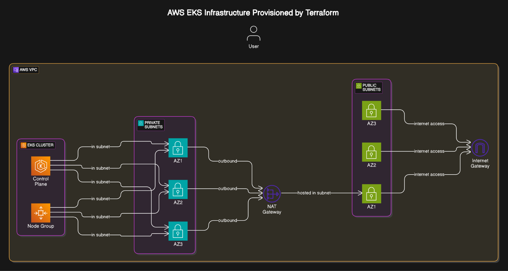
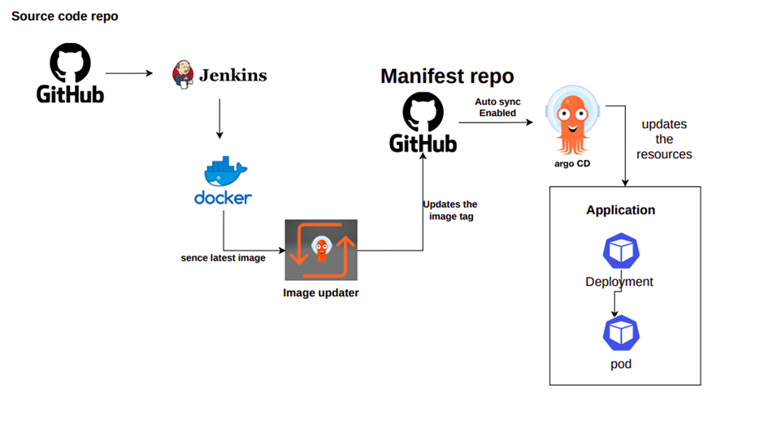
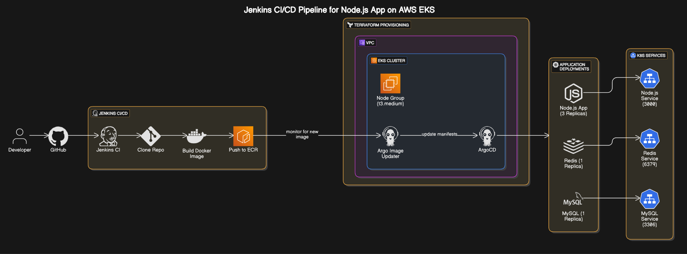

# Node.js Application Deployment on AWS EKS

## 🎯 Overview

This project provisions and deploys a production-grade CI/CD pipeline on AWS using:

- **Terraform** for infrastructure
- **Jenkins** for CI
- **ArgoCD + Argo Image Updater** for CD (GitOps)
- **Helm** for K8s resource management
- **Node.js**, **MySQL**, and **Redis** deployed in EKS

## 🌐 Architecture Diagram

##  🚀 Prerequisites 

- AWS CLI configured

- Docker

- Terraform

- kubectl

- Helm v3

🔧 Setup Instructions
1. Clone the Repository
bash
Copy
Edit
> git clone https://github.com/ITI-2025/nodejs-app-config

> cd nodejs-app-config

2. Configure AWS & Terraform Variables
3. Provision Infrastructure
> cd terraform

> terraform init

> terraform apply
4. Deploy Jenkins and ArgoCD

[Deploying Jenkins on Amazon EKS with Amazon EFS)](https://aws.amazon.com/blogs/storage/deploying-jenkins-on-amazon-eks-with-amazon-efs/)

[EKS workshop](https://www.eksworkshop.com/docs/automation/gitops/argocd/)

5. Trigger Pipeline via GitHub Push

    1. Jenkins builds Docker image and pushes to ECR.

    2. ArgoCD syncs manifests and deploys Node.js, MySQL, Redis.

    3. Argo Image Updater monitors and updates image tags.

## 🌐 Application Stack
- Node.js App (GitHub Repo)

- MySQL and Redis pods

## 📹 YouTube Demo
- ▶️ [Watch the Full Demo on YouTube](https://youtu.be/5mbmws5c33k)

